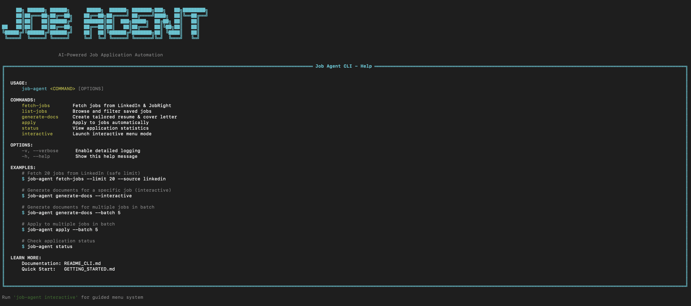

# 🤖 Automated Job Application Assistant

[](https://www.python.org/downloads/)
[](https://opensource.org/licenses/MIT)
[](https://github.com/bchikara/job_automater/stargazers)
[](https://github.com/bchikara/job_automater/issues)
[](https://github.com/bchikara/job_automater/pulls)

> 🤖 **Intelligent job application automation powered by AI.** Scrapes jobs from LinkedIn/JobRight, tailors resumes/cover letters with AI (Gemini), generates PDFs, and auto-fills ATS forms (Greenhouse, Workday). Built with Python + Selenium + MongoDB.



## 📑 Table of Contents

- [Project Goal](#-project-goal)
- [Quick Start](#-quick-start-10-minutes)
- [Core Features](#-core-features)
- [Technologies Used](#️-technologies-used)
- [CLI Commands](#-cli-commands)
- [Use Cases](#-use-cases)
- [Future Enhancements](#-future-enhancements)
- [Contributing](#-contact--support)
- [License](#-license)

## 🎯 Project Goal

This project, the "Automated Job Application Assistant," aims to simplify and automate the often repetitive process of applying for jobs online. It uses web automation to fill out application forms, leverages Artificial Intelligence (AI) to help answer questions, and keeps track of all applications in a database.

**New!** ✨ **Beautiful CLI Interface** - Now with an interactive command-line tool for easy job management, document generation, and automated applications.

Think of it as a smart assistant that helps you apply for jobs more efficiently!

## 🚀 Quick Start (10 Minutes)

```bash
# 1. Clone and navigate
git clone https://github.com/bchikara/job_automater.git
cd job_automater

# 2. Create virtual environment
python3 -m venv .venv
source .venv/bin/activate  # Windows: .venv\Scripts\activate

# 3. Install dependencies
pip install -r requirements.txt

# 4. Run interactive setup wizard (guides you through everything!)
python cli.py setup

# 5. Edit your resume data
# Edit base_resume.json and info/achievements.txt with your details

# 6. Start using Job Agent!
./job-agent interactive
# OR
python cli.py interactive
```

**Need help?** See [QUICKSTART.md](docs/QUICKSTART.md) or [SETUP_GUIDE.md](docs/SETUP_GUIDE.md) for detailed setup instructions.

## ✨ Core Features

### 🎨 Beautiful CLI Interface
* **Interactive Menu System:** Easy-to-use terminal interface with rich formatting
* **Visual Progress Indicators:** Real-time spinners and progress bars
* **Color-Coded Status:** Instantly see job statuses with intuitive color coding
* **Smart Job Selection:** Browse and select jobs with arrow keys

### 🤖 Intelligent Automation
* **Hybrid AI System:** Combines Browser-Use AI (GPT-4 Vision) with traditional Selenium for maximum success rates
* **Automated Form Filling:** Automatically fills in your information (name, email, resume, etc.) on job application websites
* **Smart ATS Handling:** Identifies different job application systems (like Greenhouse, Workday) and uses specific strategies for each
* **AI-Powered Assistance:** Uses Gemini AI to tailor resumes, analyze forms, and answer application questions
* **Intelligent Fallback:** If primary method fails, automatically tries alternative approach
* **Manual Intervention Support:** If automation fails, pauses and allows you to complete manually, then logs the outcome

### 📊 Organization & Tracking
* **MongoDB Database:** Keeps a record of every job application attempt with detailed status tracking
* **Document Management:** Generates tailored PDFs and organizes them by job
* **Status Flow:** Tracks jobs from scraping → document generation → application → success/failure
* **Batch Processing:** Apply to multiple jobs sequentially with delays

## 🛠️ Technologies Used

### Core Technologies
* **Python 3.8+:** Main programming language
* **Click:** Command-line interface creation
* **Rich:** Beautiful terminal formatting and UI
* **Questionary:** Interactive prompts and menus

### Automation & AI
* **Browser-Use:** AI-powered browser automation using GPT-4 Vision
* **Playwright:** Modern browser automation (used by Browser-Use)
* **Selenium:** Traditional web browser automation for form filling
* **Google Gemini AI:** Resume tailoring and intelligent form analysis
* **LangChain:** AI integration framework
* **BeautifulSoup:** HTML parsing for page analysis

### Data & Storage
* **MongoDB:** Application history, job tracking, and status management
* **PyMongo:** MongoDB driver for Python

### Document Generation
* **LaTeX (pdflatex):** Professional PDF generation
* **ReportLab:** PDF creation and manipulation
* **PyPDF2:** PDF handling

## 📋 CLI Commands

```bash
# Interactive mode (recommended)
python cli.py interactive

# Fetch jobs from job boards
python cli.py fetch-jobs --source both --limit 50

# List jobs with filters
python cli.py list-jobs --status new --status docs_ready

# Generate tailored documents
python cli.py generate-docs --interactive

# Apply to jobs
python cli.py apply --interactive          # Single job
python cli.py apply --batch 5              # Multiple jobs

# View statistics
python cli.py status

# Check configuration
python cli.py config-info
```

See the CLI help for complete documentation: `python cli.py --help`

## ✅ Use Cases

* **Active Job Seekers:** Apply to multiple roles daily with AI-tailored resumes
* **Career Changers:** Generate targeted applications for different industries
* **Recent Graduates:** Mass application during placement season
* **Recruiters:** Handle client applications at scale
* **Resume Optimization:** A/B test different resume variations

## 📈 Future Enhancements

* **Captcha Solver Integration:** Handle 2Captcha for protected forms
* **LinkedIn Easy Apply:** One-click applications on LinkedIn
* **Multi-Profile Support:** Switch between different resume profiles
* **Telegram/Email Alerts:** Real-time notifications for application status
* **Analytics Dashboard:** Web UI with success metrics and insights
* **More ATS Support:** Lever, iCIMS, Taleo, and custom platforms

---

## 📞 Contact & Support

**Creator:** Bhupesh Chikara
**Email:** bhupeshchikara@gmail.com
**Website:** [builtbychikara.dev](https://www.builtbychikara.dev)
**Phone:** +1 315-575-7385

### Get Help
- 📖 **Documentation:** Check [SETUP_GUIDE.md](docs/SETUP_GUIDE.md) and [QUICKSTART.md](docs/QUICKSTART.md)
- 🐛 **Issues:** Report bugs at [GitHub Issues](https://github.com/bchikara/job_automater/issues)
- 💡 **Feature Requests:** Submit ideas via GitHub Issues
- 🤝 **Contributing:** See [CONTRIBUTING.md](CONTRIBUTING.md) for guidelines

### Support the Project
If this project helped you land a job or save time in your job search:
- ⭐ Star this repository
- 🐛 Report bugs and suggest improvements
- 🤝 Contribute code or documentation
- 📢 Share with others who might find it useful

---

## 📄 License

This project is licensed under the MIT License - see [LICENSE](LICENSE) for details.

---

> Built with ❤️ by Bhupesh Chikara | Making job hunting less painful, one application at a time!


