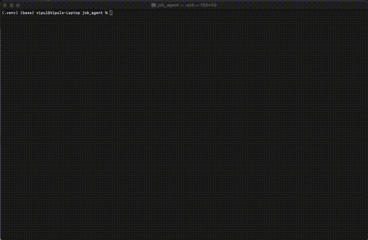

# 🤖 Automated Job Application Assistant

## 🎯 Project Goal

This project, the "Automated Job Application Assistant," aims to simplify and automate the often repetitive process of applying for jobs online. It uses web automation to fill out application forms, can leverage Artificial Intelligence (AI) to help answer questions, and keeps track of all applications in a database.

Think of it as a smart assistant that helps you apply for jobs more efficiently!

## ✨ Core Features

* **Automated Form Filling:** Automatically fills in your information (name, email, resume, etc.) on job application websites.
* **Smart ATS Handling:** Identifies different job application systems (like Greenhouse, Workday) and uses specific strategies for each.
* **AI-Powered Assistance:** Can use AI (like GPT models) to suggest how to fill certain fields or even help draft answers to common application questions.
* **Organized Tracking:** Keeps a record of every job application attempt in a MongoDB database, noting whether it was successful, failed, or required manual help.
* **Interactive Error Mode:** If the robot gets stuck, it doesn't just give up! It pauses, keeps the browser open, and asks *you* (the user) to help by completing that tricky step manually. You then tell the robot what happened, and it logs the outcome.
* **Document Management:** Handles your resume and cover letter files, and organizes application-related files after each attempt.

## 🛠️ Technologies Used

* **Python:** The main programming language for the project.
* **Selenium:** A powerful tool for controlling web browsers automatically (this is how it "clicks" buttons and fills out forms).
* **BeautifulSoup / lxml (optional):** For scraping static content where needed.
* **MongoDB:** For storing application history, errors, and statuses.
* **OpenAI GPT API:** To assist with answering common job questions or generating content like cover letters.
* **PDF Libraries (e.g., PyPDF2 or pdfplumber):** For extracting and handling data from resumes if needed.
* **dotenv / ConfigParser:** For secure handling of user credentials and configuration.
* **Flask / FastAPI (optional):** If you want to add a web UI or API interface.
* **Docker (optional):** For consistent deployment and packaging.

## ✅ Potential Use Cases

* Job seekers applying to multiple roles daily.
* Recruiters or placement agencies handling applications at scale.
* Integration with resume optimization tools.
* College students doing mass applications during placement season.

## 📈 Future Enhancements

* **Captcha Solver Integration:** Use 2Captcha or similar services to handle basic captchas.
* **LinkedIn Easy Apply Automation**
* **Multi-Profile Support:** Switch between multiple user profiles/resumes.
* **Telegram/Email Alerts:** Notify users about application status or manual intervention needs.
* **Analytics Dashboard:** Show metrics like success rate, common failures, and time spent.

---

> This project is a work in progress and contributions are welcome!

